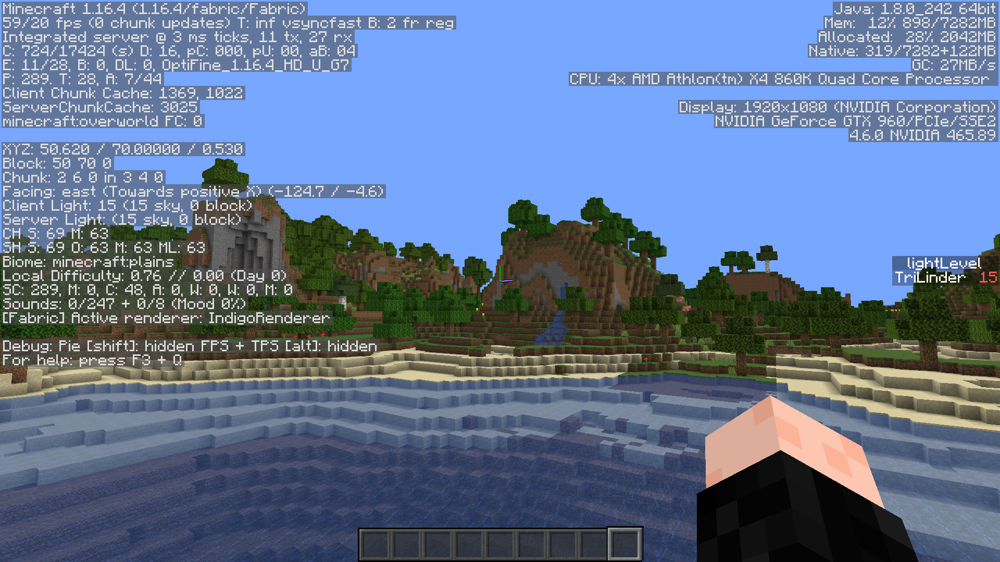
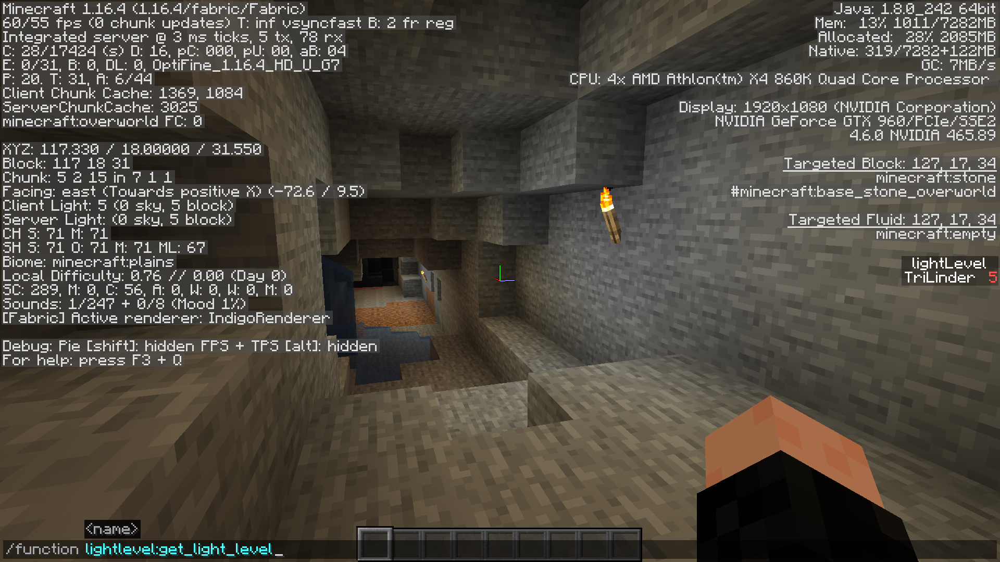
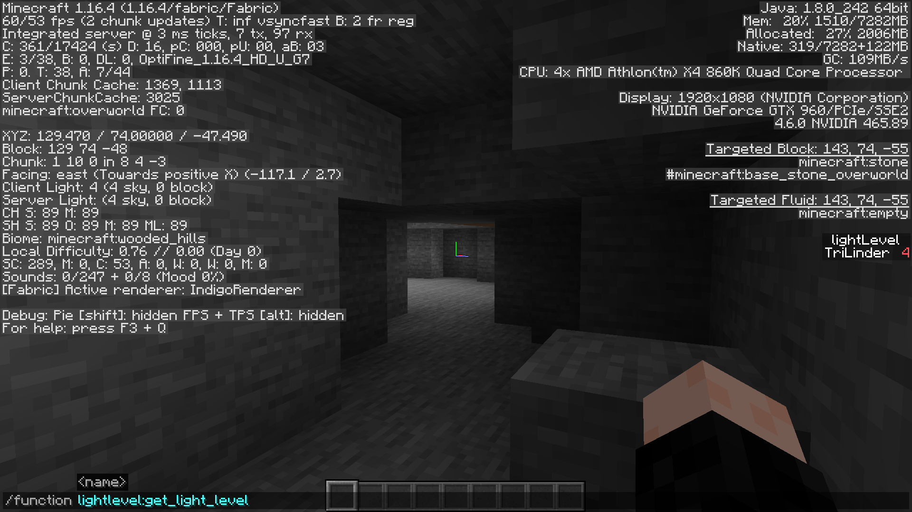

# LightLevel API
 

A simple and fast datapack API to add to your datapack.

**How to use:**

​	Execute `/function lightlevel:get_light_level` on an entity

​	The result will be instantly saved to the `lightLevel` objective.

**Credits?**

​	No crediting is *required*, but would be nice if you linked my GitHub profile somewhere (even as comment in your code).

**Screenshots:**

